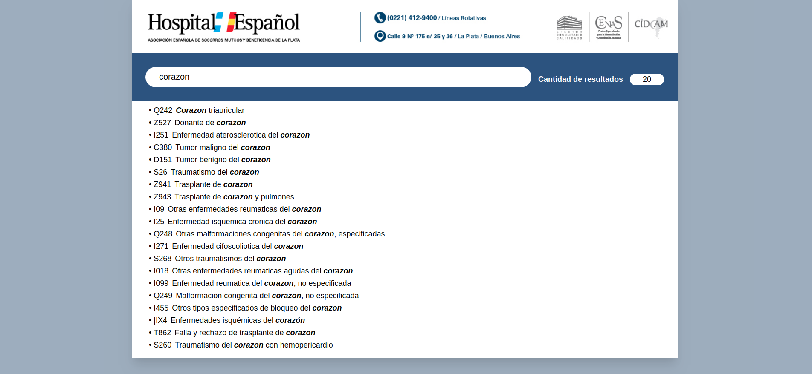

# Hospital Español - Estandar ICD-10

Frontend para búsqueda de diagnosticos según el estandar [ICD-10](https://en.wikipedia.org/wiki/ICD-10)

## Requisitos

1. [yarn](https://yarnpkg.com/en/)
    ```bash
      curl -sS https://dl.yarnpkg.com/debian/pubkey.gpg | sudo apt-key add -
      echo "deb https://dl.yarnpkg.com/debian/ stable main" | sudo tee /etc/apt/sources.list.d/yarn.list
      sudo apt update -y && sudo apt install -y yarn
    ```

## Instalación

1. Clonar el repositorio.

```bash
  git clone https://github.com/ortuagustin/diagnosticos-ICD10.git
  cd diagnosticos-ICD10
```

2. Ejecutar `yarn install` para instalar las dependencias
3. Ejecutar `yarn serve` para levantar la aplicación de manera local. Acceder a la URL que se informa en consola
4. Ejecutar `yarn build` para compilar y deployar


